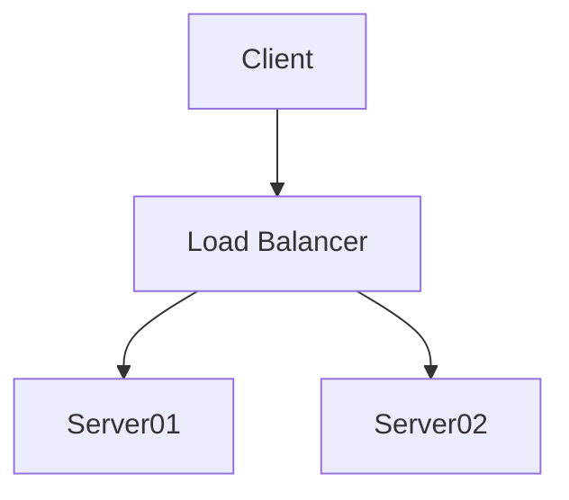
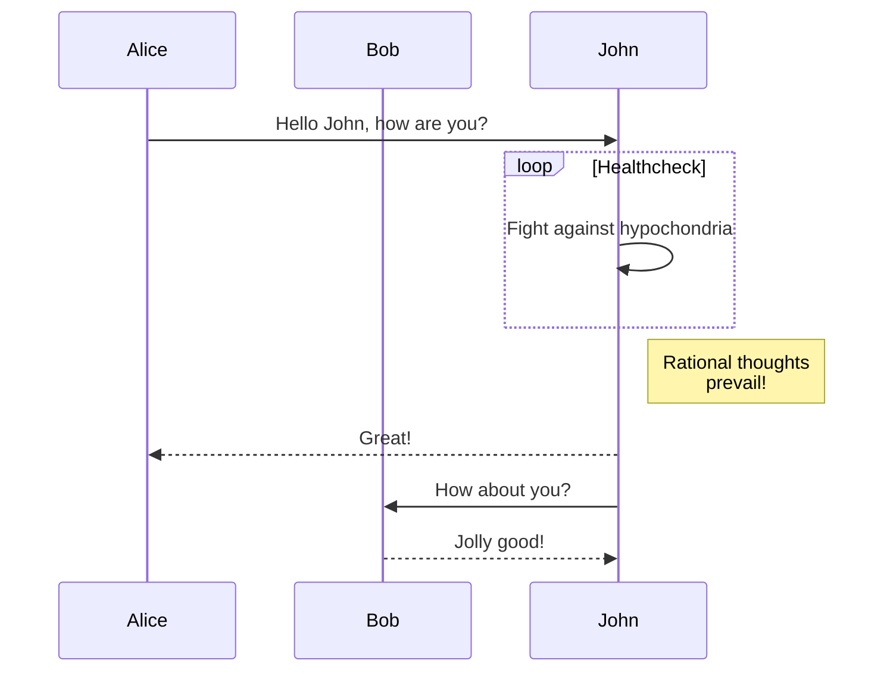
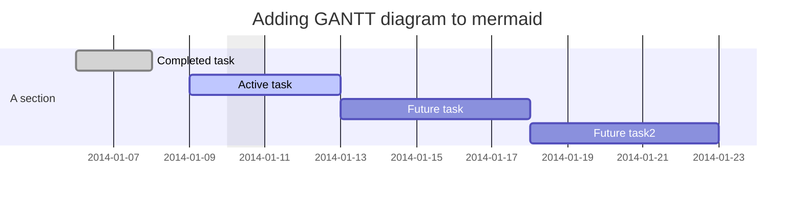

# Welcome to my tech docs

Now that we _finally_ have an instance of backstage working with the techdocs plugin, I'll update this with some lorem ipsum, and other random things.

## Backstage Default provided icons

Some parts of the `catalog-info.yaml` may accept an icon string.
Here's a list of the default icons that Backstage supports out of the box (from the actual code):

```typescript
declare type AppIcons = {
    'kind:api': IconComponent;
    'kind:component': IconComponent;
    'kind:domain': IconComponent;
    'kind:group': IconComponent;
    'kind:location': IconComponent;
    'kind:system': IconComponent;
    'kind:user': IconComponent;
    brokenImage: IconComponent;
    catalog: IconComponent;
    chat: IconComponent;
    dashboard: IconComponent;
    docs: IconComponent;
    email: IconComponent;
    github: IconComponent;
    group: IconComponent;
    help: IconComponent;
    scaffolder: IconComponent;
    search: IconComponent;
    techdocs: IconComponent;
    user: IconComponent;
    warning: IconComponent;
};
```

## How we finally got it working

I believe the core issue with previous attempts to set this up was with file permissions. The techdocs are generated locally on the container using the `mkdocs` command. The backend spawns a child process to invoke the command, then copies all the files to a location where they can be statically served. But, when we look at the temporary directory where the files are initially created, we see strange `dwrx------` permissions. 

I can only assume this is a bug with the debian bullseye release & whatever version of docker / podman that openshift is running. It's not difficult to find forum posts about permissions issues with docker & bullseye. And the advice is always to update docker. 

So when we replaced the base docker image with `node:16-buster-slim`, suddenly things started working

## More filler content 

Credit to [hipsum](https://hipsum.co/) for these truly moving words...

I'm baby hexagon normcore fanny pack minim anim tumblr. Taxidermy vegan raw denim proident synth. Everyday carry enamel pin air plant pug godard cardigan 3 wolf moon fashion axe mumblecore aliquip tumeric try-hard. Bushwick pug helvetica direct trade shaman non. Artisan aute lyft forage tofu ullamco.

Air plant biodiesel consectetur, keffiyeh culpa kombucha migas forage leggings fingerstache cliche ex ennui pabst. Offal deep v hammock prism vegan hella. Vaporware edison bulb asymmetrical, eu woke swag officia waistcoat synth tousled subway tile disrupt photo booth. Blue bottle cray fingerstache, ramps hammock pour-over pug nostrud biodiesel austin. Keffiyeh yr salvia copper mug pitchfork.

Et godard excepteur eu YOLO, aesthetic flexitarian ullamco shoreditch. Man braid bicycle rights photo booth hammock distillery hexagon chia flexitarian, incididunt biodiesel offal DIY try-hard. Bespoke reprehenderit ramps, hexagon waistcoat meh lyft leggings kitsch chartreuse non ut shaman. Pok pok excepteur hot chicken tbh vexillologist taiyaki, ut distillery.

Keffiyeh franzen raclette mustache dolore quinoa trust fund authentic activated charcoal 90's chicharrones veniam sriracha. Meditation adipisicing williamsburg portland pabst, cardigan meggings laborum chicharrones. Humblebrag tote bag meggings commodo. Elit food truck copper mug trust fund keffiyeh, aesthetic dolore kombucha umami pug. Distillery cardigan meggings quis duis. Heirloom poutine narwhal, lorem sunt drinking vinegar distillery keffiyeh listicle mlkshk cardigan disrupt.

Drinking vinegar viral 8-bit retro dreamcatcher tilde, laboris sunt cillum cloud bread. Minim sriracha kale chips, mlkshk small batch williamsburg salvia sint asymmetrical cronut laborum unicorn thundercats. Hot chicken tacos fanny pack qui sunt truffaut ut offal chartreuse XOXO. Vice retro waistcoat ipsum voluptate craft beer. Meditation culpa small batch tempor 3 wolf moon. Celiac leggings ramps locavore dolor aliquip.


## Some code snippets

Let's show some code snippets

### Java

```java
public final class HelloWorld {

  public static void main(String[] args) {
    System.out.println("Hello world!");
  }

}
```

### Docker

```Dockerfile
FROM FROM node:16-buster-slim as base
RUN apt-get update -y \
 && apt-get upgrade -y
 
CMD ["echo", "hello world!"]
```

### Mermaid

Okay, now the real test. Can we render mermaid diagrams? (These are just copy-pasted from [their website](https://mermaid-js.github.io/mermaid/#/))

From the mkdocs plugin:


Flow chart:


Sequence diagram:


Gantt chart:
